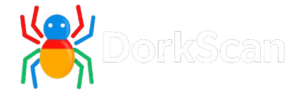

<p align="center">
  
</p>

# DorkScan

DorkScan is an automated Google Dorks scanning tool that uses Brave Search. It is designed for security researchers, OSINT professionals, and ethical hacking enthusiasts who want to identify exposed resources on specific domains.

---

## Table of contents

- [Features](#features)
- [Requirements](#requirements)
- [Included files](#included-files)
- [Installation](#installation)
- [Usage](#usage)
- [Parameters](#parameters)
- [License](#license)
- [Contact](#contact)

---

## Features

- Dynamic generation of custom dorks from templates.
- Automated navigation with Playwright and User-Agent rotation.
- Pre-validation of the target domain before starting the scan.
- Extraction of results from Brave Search.
- Optional saving of results to a local file.

---

## Requirements

- Python 3.12 or higher.
- Playwright installed and configured:

```bash
pip install playwright
playwright install
```

- Dependencies listed in `requirements.txt` (if applicable).

---

## Included files

- `dorks.txt` — contains 45 ready-to-use dorks with `{domain}` as a placeholder.
- `user-agents.txt` — contains 30 user agents for automatic rotation.
- `results.txt` (optional) — file where results can be saved.
- `DorkScan.py` — main script.
- `LICENSE` — project license.
- `README.md` — project documentation.

---

## Installation

Clone the repository and change into the project directory:

```bash
git clone https://github.com/yagoislas5/dorkscan.git
cd dorkscan
```

(Optional) Create and activate a virtual environment:

```bash
python3 -m venv .venv
source .venv/bin/activate
```

Install dependencies:

```bash
pip install -r requirements.txt
```

Make sure Playwright and its browsers are installed if the script performs real navigation:

```bash
playwright install
```

---

## Usage

Run the DorkScan script specifying the target domain:

```bash
python3 DorkScan.py domain.com --save
```

The script will validate whether the domain is available before starting the scan. Results are retrieved from Brave Search and filtered to show only valid links.

---

## Parameters

- `domain.com`: target domain to scan.
- `--save` or `-OG`: saves results to the `results.txt` file.

---

## License

This project is distributed under the **Non-Commercial Use License – Yago 2025**.

- Free to use for personal, educational, or research purposes.
- Commercial use is prohibited without the author's express permission.
- Attribution required with name and link to the GitHub profile.

For more details, see the `LICENSE` file.

---
#### Estado del proyecto
DorkScan se encuentra actualmente fuera de funcionamiento. Google ha detectado el patrón de automatización utilizado por la herramienta y ha implementado un CAPTCHA en sus resultados, lo que impide la ejecución automática de las búsquedas. Estamos evaluando alternativas y motores de búsqueda más permisivos para futuras versiones.

---
## Contact

For inquiries, collaborations, or commercial arrangements, you can contact the author via their GitHub profile:

[https://github.com/yagoislas5](https://github.com/yagoislas5)
